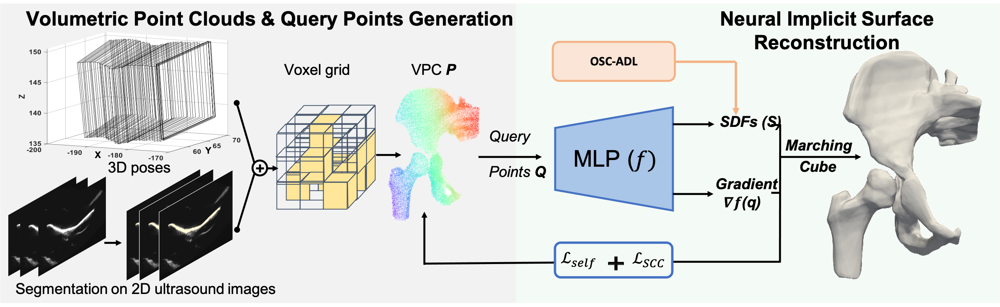

## FUNSR: Neural Implicit Surface Reconstruction of Freehand 3D Ultrasound Volume with Geometric Constraint

--------------------------------------
[**Paper**](https://www.sciencedirect.com/science/article/abs/pii/S1361841524002305?dgcid=raven_sd_aip_email#preview-section-introduction) | [**Arxiv**](https://arxiv.org/abs/2401.05915)  <br>

The official implementation code for Medical Image Analysis paper:
Neural Implicit Surface Reconstruction of Freehand 3D Ultrasound Volume with Geometric Constraint


FUNSR is a **F**reehand 3D **U**ltrasound **N**eural **S**urface **R**econstruction method built on neural implicit signed distance functions for freehand 3D ultrasound imaging and surface rendering. 

<div align="center">

</div>


## Demo
* Example results of publicly available [Dataset \#4](https://muregpro.github.io/).

<div align="center">

</div>


--------------------------------------

## Usage

Our code is implemented in Python 3.8, PyTorch 1.12.1 and CUDA 11.6


### Install Dependencies 
```bash
conda create -n funsr python=3.8
conda activate funsr
conda install pytorch==1.12.1 torchvision==0.13.1 torchaudio==0.12.1 cudatoolkit=11.6 -c pytorch -c conda-forge
pip install tqdm pyhocon==0.3.57 trimesh PyMCubes scipy
pip install matplotlib
```

### Data Preparation

- Put the point cloud data on ./data.

- The point cloud data format is in *.ply.

### Run FUNSR

```
python run_normalizedSpace.py --gpu 0 --conf confs/conf.conf --dataname case000070.nii_ds  --dir case000070.nii_ds
 ```

 ### Contact
For any queries, please contact [chenhb[at]shanghaitech.edu.cn](mailto:chenhb@shanghaitech.edu.cn).

--------------------------------------

### References
The reference codes are from the following links.
We appreciate all the contributors.

* NeuralPull: https://github.com/mabaorui/NeuralPull-Pytorch

* GenSDF: https://github.com/princeton-computational-imaging/gensdf

* PU-GAN: https://github.com/liruihui/PU-GAN
